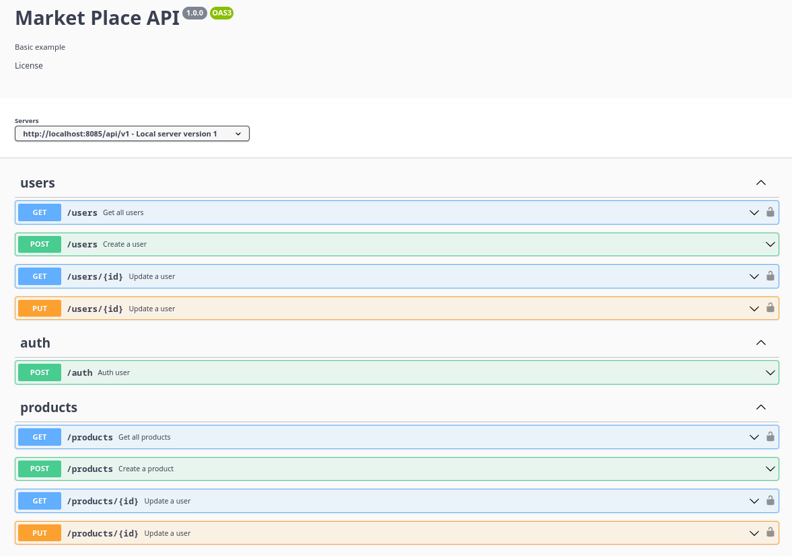
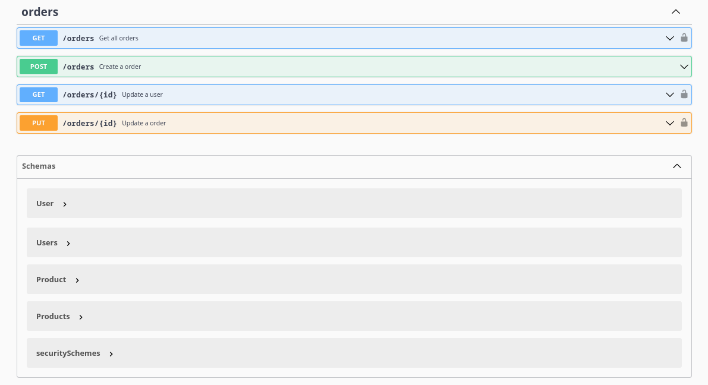

# Market Place Client

This is an application that allows the creation and authentication of accounts, association of these accounts to some types that will receive different levels of permissions. Creation of product sales advertisements.

## Features

- Create, read, Update and delete
- JWT token
- Auth Middlewares

## Screenshots
<div style="display: flex; width: 100%;">
 
 
</div>


## Installation

Install dependencies

```bash
  yarn install
```

Run project

```bash
  yarn dev
```
    
## Main technologies used

- [Typescript](https://www.typescriptlang.org/) - TypeScript is a programming language developed and maintained by Microsoft. It is a strict syntactical superset of JavaScript and adds optional static typing to the language. TypeScript is designed for the development of large applications and transcompiles to JavaScript.

- [Express](https://expressjs.com/) - Express.js, or simply Express, is a back end web application framework for Node.js, released as free and open-source software under the MIT License. It is designed for building web applications and APIs. It has been called the de facto standard server framework for Node.js.

- [TypeOrm](https://typeorm.io/) - TypeORM is a TypeScript ORM (object-relational mapper) library that makes it easy to link your TypeScript application up to a relational database database. TypeORM supports MySQL, SQlite, Postgres, MS SQL Server, and a host of other traditional options.
 
## Authors

- [Gerssivado Santos](https://www.github.com/gerssivaldosantos)
